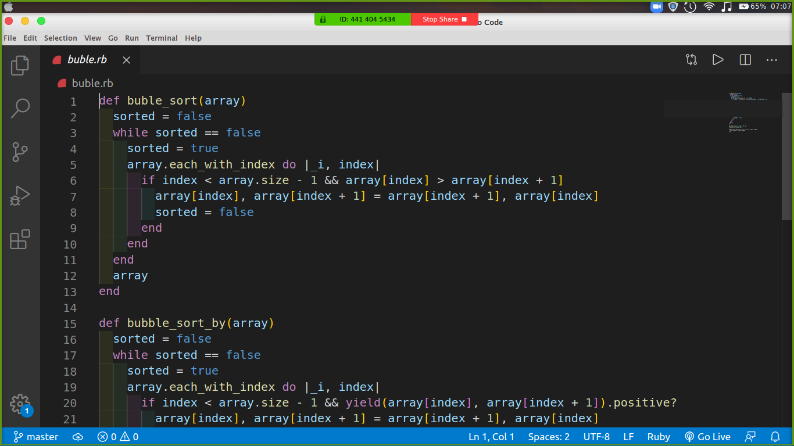

# Bubble Sort Algorithm

## Description

    We made a bubble sort algorithm that can either sort arrays of numbers or arrays of strings accordingly with the block passed as an argument on the method.

## Built With

- Ruby
- Vs Code
- Rubocop

## Live Demo

[Live Demo Link](https://repl.it/@expjazz/ProperDramaticMosaic)

## Getting Started

To get a local copy up and running follow these simple example steps.

### Prerequisites

- Ruby

### Usage

- Clone the project to your local machine
- Open the buble.rb file on your terminal

## Author

- Okiror Frank
- Expedito Andrade

👤 **Okiror Frank**

- Github: [@frankopkusianwar](https://github.com/frankopkusianwar)
- Twitter: [@franko0781](https://twitter.com/franko0781)
- Linkedin: [Okiror Frank](https://linkedin.com/in/frank-okiror-250076b5)
- Email: okirorfrank3@gmail.com

👤 **Expedito Andrade**

- Github: [@githubexpjazz](https://github.com/expjazz)
- Twitter: [@expjazz](https://twitter.com/expeditoandrade13)
- Linkedin: [Expedito Andrade](https://www.linkedin.com/in/expedito-andrade-3645151a4/)
- Email: expeditojazz@gmail.com

## 🤝 Contributing

Contributions, issues and feature requests are welcome!

Feel free to check the [issues page](issues/).

## Show your support

Give a ⭐️ if you like this project!

## Acknowledgments

- Microverse, standup team and the microverse community for helping build the skills that were used on this project

## 📝 License

This project is [MIT](lic.url) licensed.
